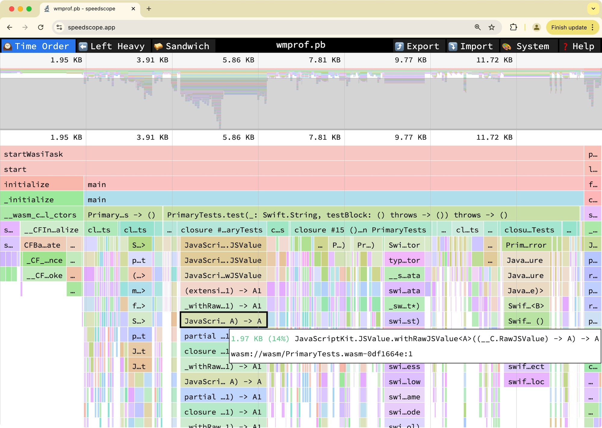

# wasm-memprof - A heap memory profiler for WebAssembly

[](https://www.npmjs.com/package/wasm-memprof)

A sampling-based heap memory profiler for WebAssembly on JavaScript engines.

## Features

- **No modification required**: You don't need to modify your WebAssembly module to profile memory usage.
- **pprof format**: The memory profile is saved in the pprof format, which can be visualized by many existing tools.
- **Sampling-based**: The profiler samples memory allocation stack traces to reduce the overhead.

## About

`wasm-memprof` enables you to profile the heap memory usage of WebAssembly instances **without asking you to recompile your WebAssembly module**. It instruments your WebAssembly module to intercept memory allocation and deallocation calls, and then collects memory allocation stack traces.
All what you need to do is to wrap the `WebAssembly` object with `WMProf.wrap` and then you can dump the memory profile to a **pprof** file.

## Installation

```
npm install wasm-memprof
```

## Usage

```js
import { WMProf } from "wasm-memprof";

const WebAssembly = WMProf.wrap(globalThis.WebAssembly);
const { instance } = await WebAssembly.instantiate(buffer);
instance.exports.myFunction();

// Get profiler instance associated with the WebAssembly instance
const wmprof = WMProf.get(instance);
// Download the pprof profile file to the client
wmprof.downloadSnapshot();
// Or get the pprof profile bytes (Uint8Array)
const pprof = wmprof.toPprof();
fs.writeFileSync(`wmprof-${Date.now()}.pb`, pprof);

// Get all installed profilers
const profilers = WMProf.installed();
```

## Visualize pprof profile results

### [pprof](https://github.com/google/pprof/)

You can use the pprof tool to visualize the result.

```
go tool pprof -http=":8081" ./path/to/wmprof-XXXXX.pb
```


### [Speedscope](https://www.speedscope.app/)

You can upload the pprof profile file to the speedscope website to visualize the result.



## Limitations

1. This profiler currently supports only V8-based JavaScript engines (e.g., Chrome, Chromium-based browsers, Node.js) because it relies on V8's [Stack trace API](https://v8.dev/docs/stack-trace-api). We are happy to accept contributions to support other JavaScript engines.

2. WebAssembly modules profiled by `wasm-memprof` must have debug names for their memory allocator functions:
    - `malloc`
    - `free`
    - `calloc`
    - `realloc`
    - `posix_memalign`
    - `aligned_alloc`

    Otherwise, the profiler will not be able to intercept memory allocation and deallocation calls.


## Advanced Usage

### Demangle language-specific function names

We currently provide only a Swift demangler, but you can implement your own demangler for other languages.

```js
import { WMProf } from "wasm-memprof";
import { SwiftDemangler } from "wasm-memprof/plugins/swift-demangler.js";

const swiftDemangler = SwiftDemangler.create();
const WebAssembly = WMProf.wrap(globalThis.WebAssembly, {
  demangler: swiftDemangler.demangle.bind(swiftDemangler),
});
```

### Capture all allocations without sampling

By default, the profiler samples memory allocations to reduce the overhead. If you want to capture all allocations, you can set the `sampleRate` option to `1`, which means the profiler traces every memory allocation.

```js
import { WMProf } from "wasm-memprof";

const WebAssembly = WMProf.wrap(globalThis.WebAssembly, {
  sampleRate: 1,
});
```
